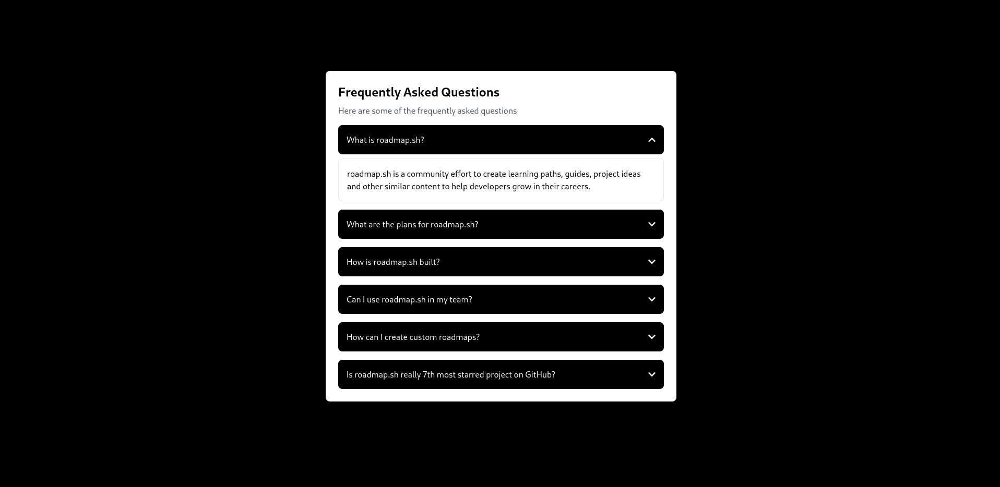
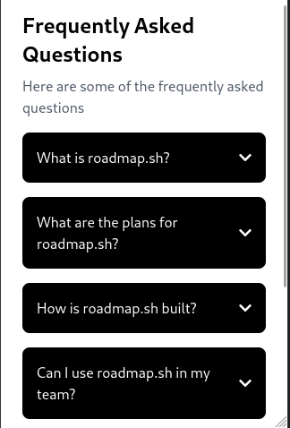

# Accordion FAQ Component

<p align="center">
  
</p>

## ✨ Overview

An elegant, interactive FAQ accordion component built with HTML, Tailwind CSS, and vanilla JavaScript. This component provides a clean, modern interface for displaying frequently asked questions in a collapsible format.

## 🎯 Features

- **Sleek Dark Theme** - Black background with white text for high contrast
- **Smooth Animations** - Elegant open/close transitions
- **Icon Rotation** - Chevron icons rotate to indicate state
- **Fully Responsive** - Works perfectly on all device sizes
- **Font Awesome Icons** - Beautiful, scalable vector icons

## 🛠️ Technologies

- HTML5
- Tailwind CSS (via CDN)
- Vanilla JavaScript
- Font Awesome 5

## 📱 Preview

<p align="center">
  
  
</p>

## 💻 Implementation

The accordion functionality is implemented with a simple JavaScript function that:
- Toggles content visibility
- Switches between up and down chevron icons
- Provides visual feedback to users

## 🚀 Usage

Simply open `index.html` in any modern browser to see the component in action.

```bash
# Clone the repository
git clone https://github.com/TheRealSaiTama/SimpleHTML.git

# Navigate to the project directory
cd SimpleHTML/AccordianProject

# Open index.html in your browser
open index.html
```

## 📄 License

MIT License

## 👨‍💻 Author

[@TheRealSaiTama](https://github.com/TheRealSaiTama)

---

<p align="center">Part of the <a href="https://github.com/TheRealSaiTama/SimpleHTML">SimpleHTML</a> collection.</p>