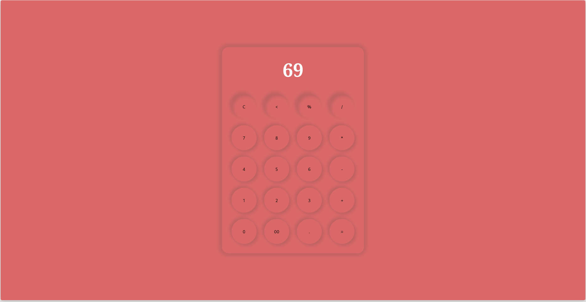

# Calculator App


## Overview

The **Calculator App** is a simple yet functional web-based calculator built using HTML, CSS, and JavaScript. It allows users to perform basic arithmetic operations such as addition, subtraction, multiplication, and division. The app also includes features like clearing the input, deleting the last character, and calculating percentages.

## Features

- **Basic Arithmetic Operations**: Perform addition (+), subtraction (-), multiplication (*), and division (/).
- **Clear Input**: Clear the entire input with the "C" button.
- **Delete Last Character**: Remove the last character from the input using the "<" button.
- **Calculate Percentages**: Calculate percentages using the "%" button.
- **Evaluate Expressions**: Evaluate complex expressions using the "=" button.
- **Stylish UI**: A clean and user-friendly interface with responsive design.

## Screenshots



## Getting Started

### Prerequisites

Ensure you have a modern web browser installed on your device.

### Installation

1. Clone the repository:
   ```bash
   git clone https://github.com/TheRealSaiTama/SimpleHTML.git
   ```

2. Navigate to the `CalculatorApp` directory:
   ```bash
   cd SimpleHTML/CalculatorApp
   ```

3. Open the `index.html` file in your web browser.

### Usage

1. Enter numbers and operators using the buttons on the calculator.
2. Use the "C" button to clear the input.
3. Use the "<" button to delete the last character.
4. Use the "%" button to calculate percentages.
5. Use the "=" button to evaluate the expression.

## Technologies Used

- **HTML5**: For structuring the calculator elements.
- **CSS3**: For styling the calculator and its components.
- **JavaScript**: For implementing the calculator logic.

## File Structure

```
CalculatorApp/
│
├── index.html
├── style.css
├── script.js
└── README.md
```

## Contributing

Contributions are welcome! If you find any bugs or have suggestions for improvements, please open an issue or submit a pull request.

## License

This project is licensed under the GPL-3.0 License - see the [LICENSE](../../LICENSE) file for details.

---
I hope you find this Calculator App useful and enjoyable! Feel free to use it as a learning resource or integrate it into your own projects. Happy coding! 😊
