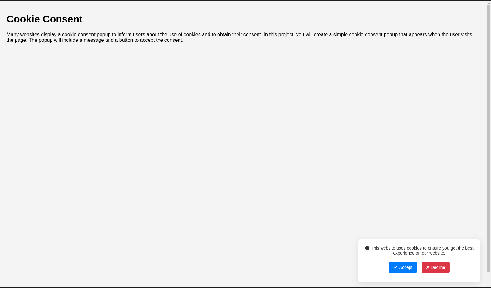

# 🍪 Cookie Consent Component

   

<div align="center">
    
    <p><em>Cookie consent popup in action</em></p>
</div>

## ✨ Features

- 🚀 Lightweight and responsive design
- 🎨 Smooth animations and transitions
- 🔒 Cookie storage for user preferences
- 🔄 Remembers user choice for 30 days
- 📱 Mobile-friendly interface
- 🎭 Font Awesome icons integration

## 📋 Overview

This elegant Cookie Consent popup notifies users about cookie usage on your website while providing options to accept or decline. The component appears at the bottom-right corner of the screen with a subtle animation and stores the user's preference in a browser cookie.

## 🛠️ How It Works

The component consists of three main functions:

```javascript
createCookieConsentPopup() // Creates and displays the popup
setCookie() // Stores user preferences
checkCookieConsent() // Verifies if user has already made a choice
```

## 🎨 Styling

The popup features a clean white background with subtle shadow effects:

- 🔵 Blue button for accepting cookies
- 🔴 Red button for declining cookies
- 📝 Clear and concise messaging
- 🌊 Smooth entry animation

## 🚀 Usage

Simply include the code in your HTML file, and the cookie consent popup will automatically appear for new visitors.

## 🔧 Customization

You can easily customize:

- Colors and styling
- Message content
- Cookie expiration period
- Animation timing

## 📄 License

MIT License - Feel free to use and modify!

---

<div align="center">
    <p>Built with ❤️ for better user privacy</p>
</div>
