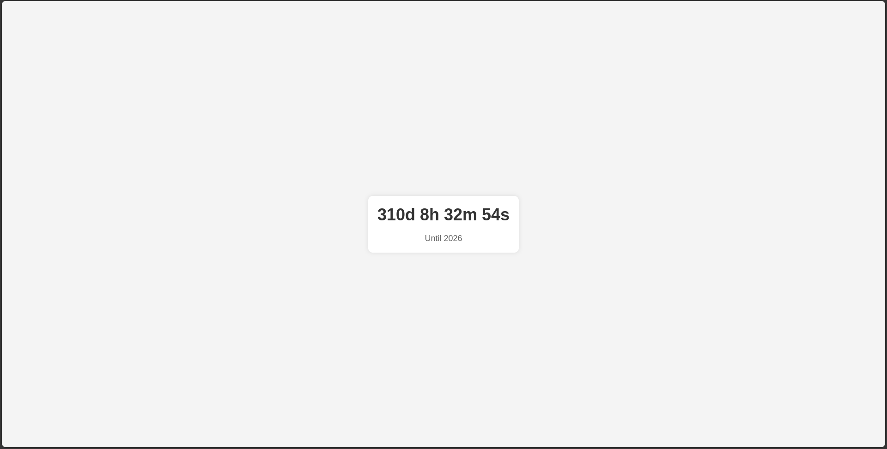

# CountDown App


## Overview

The **CountDown App** is a simple yet elegant countdown timer built using HTML, CSS, and JavaScript. It displays the time remaining until a specified future date (in this case, January 1, 2026). The app is designed to be visually appealing and easy to use, making it perfect for personal or professional projects.

## Features

- **Real-Time Countdown**: Displays the exact time remaining in days, hours, minutes, and seconds.
- **Responsive Design**: Works seamlessly on various screen sizes and devices.
- **Customizable Target Date**: Easily modify the target date to suit your needs.
- **Stylish UI**: Clean and modern design with smooth animations.

## Screenshots



## Getting Started

### Prerequisites

Ensure you have a modern web browser installed on your device.

### Installation

1. Clone the repository:
   ```bash
   git clone https://github.com/TheRealSaiTama/SimpleHTML.git
   ```

2. Navigate to the `CountDown` directory:
   ```bash
   cd SimpleHTML/CountDown
   ```

3. Open the `index.html` file in your web browser.

### Usage

The countdown timer will automatically start counting down from the current time to the specified target date (January 1, 2026). You can customize the target date by modifying the `targetDate` variable in the JavaScript code.

```javascript
const targetDate = new Date("2026-01-01T00:00:00").getTime();
```

### Customization

Feel free to customize the styles and functionality of the app according to your preferences. The CSS and JavaScript are straightforward and easy to modify.

## Technologies Used

- **HTML5**: For structuring the countdown timer elements.
- **CSS3**: For styling the timer and its components.
- **JavaScript**: For implementing the countdown logic.

## File Structure

```
CountDown/
│
├── index.html
└── README.md
```

## Contributing

Contributions are welcome! If you find any bugs or have suggestions for improvements, please open an issue or submit a pull request.

## License

This project is licensed under the GPL-3.0 License - see the [LICENSE](../../LICENSE) file for details.

## Contact

For any questions or feedback, feel free to contact me at [keshavsde@gmail.com](keshavsde@gmail.com).

