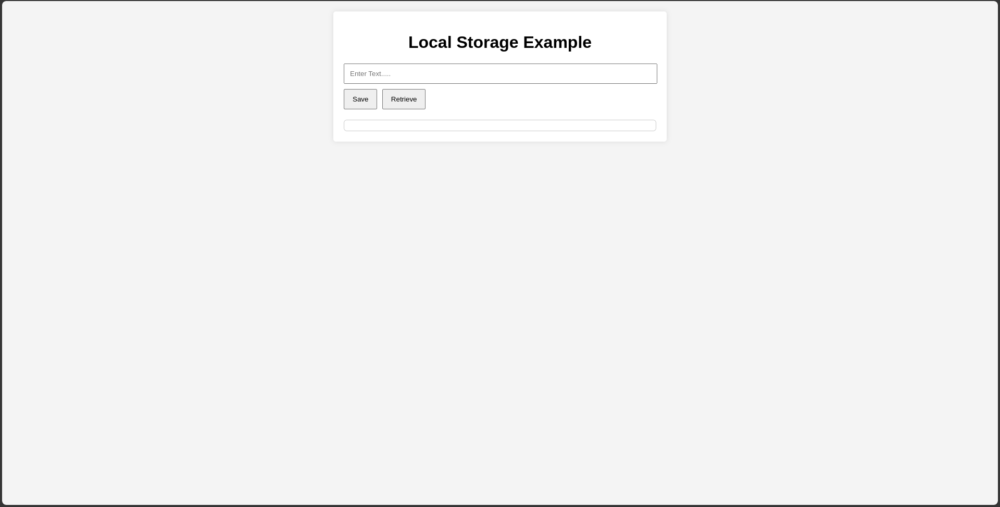

# Data Retrieval


## Overview

The **Data Retrieval** project is a simple yet effective demonstration of how to use local storage in web applications. It allows users to save text data locally and retrieve it later. The app is designed to be user-friendly and serves as a great example of using HTML, CSS, and JavaScript for client-side data storage.

## Features

- **Save Text**: Users can enter text and save it to local storage.
- **Retrieve Text**: Users can retrieve previously saved text from local storage.
- **Responsive Design**: Works seamlessly on various screen sizes and devices.
- **Stylish UI**: Clean and modern design with smooth interactions.

## Screenshots



## Getting Started

### Prerequisites

Ensure you have a modern web browser installed on your device.

### Installation

1. Clone the repository:
   ```bash
   git clone https://github.com/TheRealSaiTama/SimpleHTML.git
   ```

2. Navigate to the `DataRetrieval` directory:
   ```bash
   cd SimpleHTML/DataRetrieval
   ```

3. Open the `index.html` file in your web browser.

### Usage

1. Enter text into the input field.
2. Click the "Save" button to store the text in local storage.
3. Click the "Retrieve" button to display the saved text in the output area.

### Customization

Feel free to customize the styles and functionality of the app according to your preferences. The CSS and JavaScript are straightforward and easy to modify.

## Technologies Used

- **HTML5**: For structuring the data retrieval elements.
- **CSS3**: For styling the app and its components.
- **JavaScript**: For implementing the local storage logic.

## File Structure

```
DataRetrieval/
│
├── index.html
└── README.md
```

## Contributing

Contributions are welcome! If you find any bugs or have suggestions for improvements, please open an issue or submit a pull request.

## License

This project is licensed under the GPL-3.0 License - see the [LICENSE](../../LICENSE) file for details.

## Contact

For any questions or feedback, feel free to contact me at [keshavsde@gmail.com](mailto:keshavsde@gmail.com).

