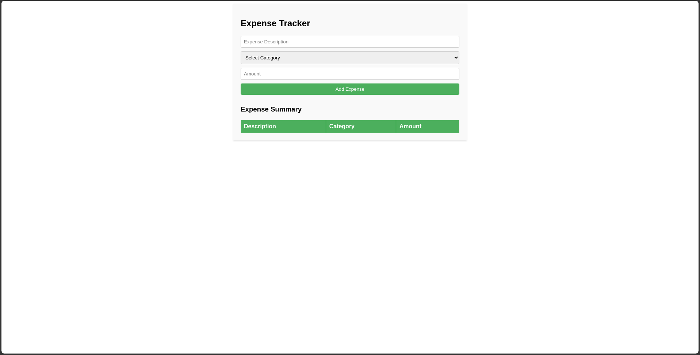

# Expense Tracker


## Overview

The **Expense Tracker** is a simple yet practical web application designed to help users keep track of their expenses. It allows users to add, categorize, and view their expenses in a tabular format. The app is built using HTML, CSS, and JavaScript, making it easy to use and customize.

## Features

- **Add Expenses**: Users can input details such as expense description, category, and amount.
- **Categorize Expenses**: Pre-defined categories like Food, Transportation, Utilities, Entertainment, and Others are available for selection.
- **View Summary**: A table displays all added expenses with their respective details.
- **Responsive Design**: Works seamlessly on various screen sizes and devices.
- **Stylish UI**: Clean and modern design with smooth interactions.

## Screenshots



## Getting Started

### Prerequisites

Ensure you have a modern web browser installed on your device.

### Installation

1. Clone the repository:
   ```bash
   git clone https://github.com/TheRealSaiTama/SimpleHTML.git
   ```

2. Navigate to the `ExpenseTracker` directory:
   ```bash
   cd SimpleHTML/ExpenseTracker
   ```

3. Open the `index.html` file in your web browser.

### Usage

1. Enter the expense description in the "Expense Description" field.
2. Select a category from the dropdown menu.
3. Enter the amount in the "Amount" field.
4. Click the "Add Expense" button to add the expense to the summary table.

### Customization

Feel free to customize the styles and functionality of the app according to your preferences. The CSS and JavaScript are straightforward and easy to modify.

## Technologies Used

- **HTML5**: For structuring the expense tracker elements.
- **CSS3**: For styling the app and its components.
- **JavaScript**: For implementing the form submission and table population logic.

## File Structure

```
ExpenseTracker/
│
├── index.html
└── README.md
```

## Contributing

Contributions are welcome! If you find any bugs or have suggestions for improvements, please open an issue or submit a pull request.

## License

This project is licensed under the GPL-3.0 License - see the [LICENSE](../../LICENSE) file for details.

## Contact

For any questions or feedback, feel free to contact me at [keshavsde@gmail.com](mailto:keshavsde@gmail.com).

