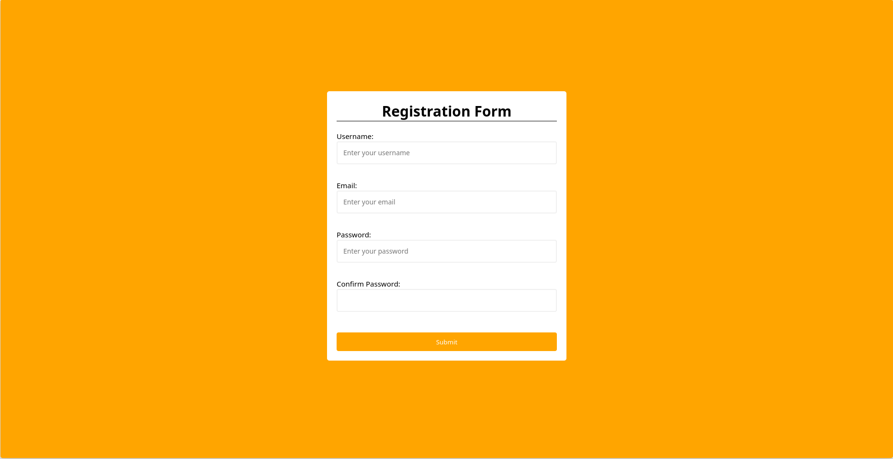

# Form Validation


## Overview

The **Form Validation** project is a simple yet effective demonstration of client-side form validation using HTML, CSS, and JavaScript. It ensures that users provide valid input before submitting a registration form. The project includes real-time error messages to guide users in correcting their input.

## Features

- **Username Validation**: Ensures the username field is not left blank.
- **Email Validation**: Checks if the email field is not empty and validates the email format.
- **Password Validation**: Verifies that the password is at least 8 characters long.
- **Confirm Password Validation**: Ensures the confirm password matches the original password.
- **Real-Time Error Messages**: Displays error messages next to each input field in real-time.
- **Stylish UI**: A clean and user-friendly interface with responsive design.


## Screenshots



## Getting Started

### Prerequisites

Ensure you have a modern web browser installed on your device.

### Installation

1. Clone the repository:
   ```bash
   git clone https://github.com/TheRealSaiTama/SimpleHTML.git
   ```

2. Navigate to the `FormValidation` directory:
   ```bash
   cd SimpleHTML/FormValidation
   ```

3. Open the `index.html` file in your web browser.

### Usage

1. Enter a username, email, password, and confirm password.
2. Real-time validation will check the inputs as you type.
3. If all fields are valid, the "Submit" button will be enabled.
4. Click the "Submit" button to complete the registration process.

## Technologies Used

- **HTML5**: For structuring the form elements.
- **CSS3**: For styling the form and its components.
- **JavaScript**: For implementing the form validation logic.

## File Structure

```
FormValidation/
│
├── index.html
├── style.css
├── script.js
└── README.md
```

## Contributing

Contributions are welcome! If you find any bugs or have suggestions for improvements, please open an issue or submit a pull request.

## License

This project is licensed under the GPL-3.0 License - see the [LICENSE](../LICENSE) file for details.

## Contact

For any questions or feedback, feel free to contact me at [keshavsde@gmail.com](mailto:keshavsde@gmail.com).
