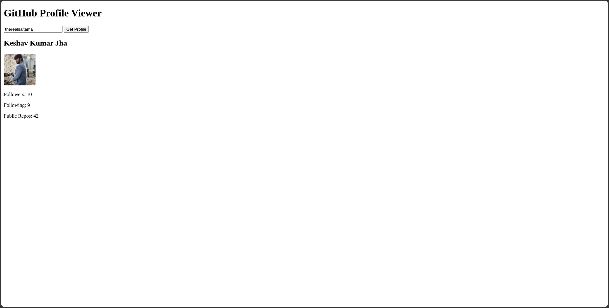

# GitHub Profile Viewer


## Overview

The **GitHub Profile Viewer** is a simple yet useful web application that allows users to view their GitHub profile information. It fetches data from the GitHub API and displays the user's name, avatar, number of followers, following, and public repositories. The app is built using HTML, CSS, and JavaScript, making it easy to use and customize.

## Features

- **Fetch Profile**: Users can enter a GitHub username and retrieve their profile information.
- **Display Information**: Displays the user's name, avatar, followers count, following count, and public repositories count.
- **Responsive Design**: Works seamlessly on various screen sizes and devices.
- **Stylish UI**: Clean and modern design with smooth interactions.

## Screenshots



## Getting Started

### Prerequisites

Ensure you have a modern web browser installed on your device.

### Installation

1. Clone the repository:
   ```bash
   git clone https://github.com/TheRealSaiTama/SimpleHTML.git
   ```

2. Navigate to the `GitHubProfileViewer` directory:
   ```bash
   cd SimpleHTML/GitHubProfileViewer
   ```

3. Open the `index.html` file in your web browser.

### Usage

1. Enter a GitHub username in the input field.
2. Click the "Get Profile" button to fetch and display the user's profile information.

### Customization

Feel free to customize the styles and functionality of the app according to your preferences. The CSS and JavaScript are straightforward and easy to modify.

## Technologies Used

- **HTML5**: For structuring the profile viewer elements.
- **CSS3**: For styling the app and its components.
- **JavaScript**: For implementing the API fetching and data display logic.

## File Structure

```
GitHubProfileViewer/
│
├── index.html
└── README.md
```

## Contributing

Contributions are welcome! If you find any bugs or have suggestions for improvements, please open an issue or submit a pull request.

## License

This project is licensed under the GPL-3.0 License - see the [LICENSE](../../LICENSE) file for details.

## Contact

For any questions or feedback, feel free to contact me at [keshavsde@gmail.com](mailto:keshavsde@gmail.com).
