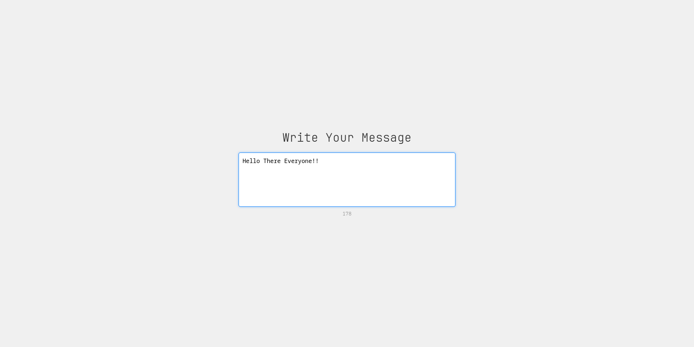

# 🔤 Restricted Text Area


<div align="center">
  
</div>

## 🌟 Overview

A sleek, modern text input component built with pure HTML, CSS, and JavaScript that provides a delightful user experience with real-time character counting and visual feedback. Perfect for comments, reviews, or any application requiring character-limited user input.

<div align="center">
  <h3>✨ Features at a Glance ✨</h3>
</div>

<table>
  <tr>
    <td align="center" width="33%">
      
      <br>
      <b>Real-time Counter</b>
      <br>
      <small>Dynamic character countdown that updates with every keystroke</small>
    </td>
    <td align="center" width="33%">
      
      <br>
      <b>Visual Feedback</b>
      <br>
      <small>Color transitions to indicate input state</small>
    </td>
    <td align="center" width="33%">
      
      <br>
      <b>Character Limit</b>
      <br>
      <small>Enforces a strict 200 character limit</small>
    </td>
  </tr>
</table>

## 🚀 Features

- ✅ **Real-time character countdown** - See exactly how many characters you have left
- ✅ **Visual feedback** with elegant color transitions:
  - Normal state: Blue focus border
  - Limit reached: Red warning border
- ✅ **Character limit enforcement** - Prevents exceeding the 200 character limit
- ✅ **Clean, modern design** - Minimalist interface with subtle shadows
- ✅ **Responsive layout** - Works perfectly on any device
- ✅ **No dependencies** - Pure vanilla JavaScript

## 🛠️ Technologies

- HTML5 for semantic structure
- CSS3 for styling and transitions
- JavaScript (Vanilla) for interactivity

## 💻 Implementation Details

The component uses event listeners to track text input in real-time:

```javascript
textarea.addEventListener('input', function() {
    const currentLength = this.value.length;
    const remaining = maxLength - currentLength;
    
    // Update the counter
    charCount.textContent = remaining;
    
    // Visual feedback based on character count
    if (currentLength >= maxLength) {
        textarea.style.borderColor = 'red';
        textarea.style.boxShadow = '0 0 5px rgba(255, 0, 0, 0.5)';
        
        // Prevent exceeding the limit
        if (currentLength > maxLength) {
            this.value = this.value.substring(0, maxLength);
        }
    } else {
        textarea.style.borderColor = '#007bff';
        textarea.style.boxShadow = '0 0 5px rgba(0, 123, 255, 0.5)';
    }
});
```

## 📋 Usage

Simply open `index.html` in any modern browser to see the component in action.

To integrate into your own project:

1. Copy the HTML structure
2. Include the CSS styles
3. Add the JavaScript for functionality

## 🔗 Integration Examples

### Contact Form
```html
<div class="contact-form">
  <h2>Send us a message</h2>
  <input type="text" placeholder="Your Name">
  <input type="email" placeholder="Your Email">
  <!-- Insert Restricted Text Area here -->
  <button type="submit">Send Message</button>
</div>
```

### Comment Section
```html
<div class="comment-section">
  <h3>Leave a comment</h3>
  <!-- Insert Restricted Text Area here -->
  <button type="submit">Post Comment</button>
</div>
```

## 📄 License

MIT License

## 👨‍💻 Author

[@TheRealSaiTama](https://github.com/TheRealSaiTama)

---

<div align="center">
  <p><i>Part of the <a href="https://github.com/TheRealSaiTama/SimpleHTML">SimpleHTML</a> collection.</i></p>
  <p>Inspired by <a href="https://roadmap.sh/projects/restricted-textarea">roadmap.sh</a></p>
</div>
