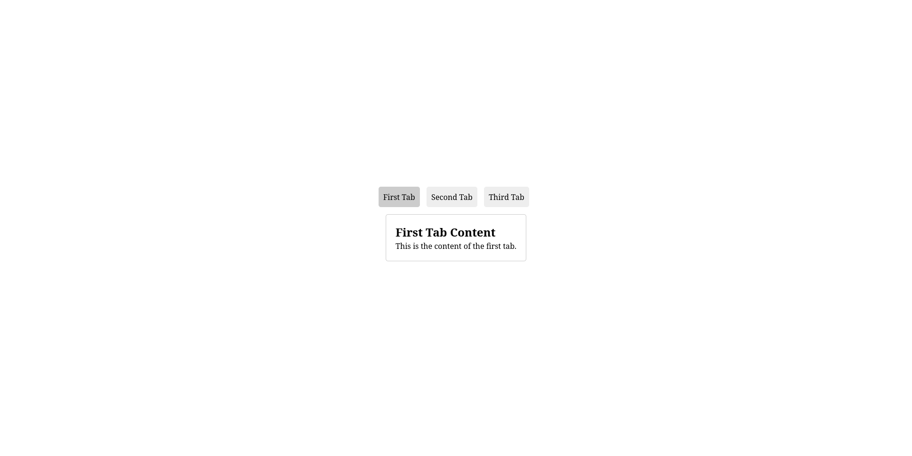

# Tabs Component

A lightweight, customizable tabs interface built with vanilla JavaScript, HTML, and CSS.



## Features

- ✨ Clean, minimalist design
- 🚀 Vanilla JavaScript - no dependencies
- 📱 Responsive and mobile-friendly
- 🎨 Easily customizable
- ⚡ Lightweight and fast

## Installation

Clone the repository:

```bash
git clone https://github.com/TheRealSaiTama/SimpleHTML.git
cd SimpleHTML/Tabs
```

Or download the files directly:
- index.html
- style.css
- script.js

## Usage

Simply open `index.html` in your browser to see the tabs in action.

### Structure

```html
<div class="tabs">
    <ul>
        <li><a href="#tab1">First Tab</a></li>
        <li><a href="#tab2">Second Tab</a></li>
        <li><a href="#tab3">Third Tab</a></li>
    </ul>

    <div class="tab-content" id="tab1">
        <!-- Content for first tab -->
    </div>
    <!-- More tab content divs -->
</div>
```

## Customization

You can easily customize the appearance by modifying the CSS in `style.css`. Some key styling elements:

```css
div ul li {
    /* Tab styling */
}

div ul li.active {
    /* Active tab styling */
}

.tab-content {
    /* Content panel styling */
}
```

## How It Works

The JavaScript in `script.js` handles:
- Showing/hiding tab content
- Tracking active tabs
- Managing click events
- Setting defaults on page load

## License

MIT

## Contributing

Contributions are welcome! Please feel free to submit a Pull Request.
