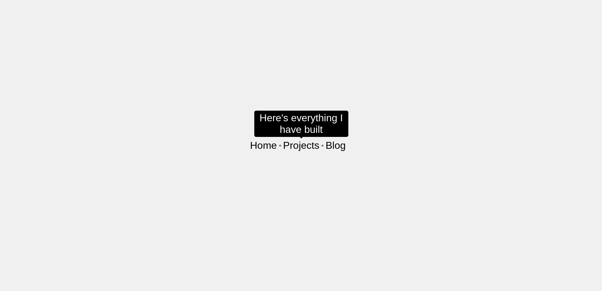

# Tooltip UI: A Sleek Hover - Based Information Display


## 🚀 Introduction
The Tooltip UI project is a remarkable implementation of tooltips in a web - based environment. Inspired by [roadmap.sh/projects/tooltip-ui](https://roadmap.sh/projects/tooltip-ui), it brings to life the concept of providing additional information on - demand. Tooltips are those handy little boxes that pop up when you hover over an element, giving you extra details without cluttering the main interface. This project uses nothing but pure HTML and CSS to create an elegant and functional tooltip system.

## 🌟 Features
- **Responsive Design**: The tooltips adapt gracefully to different screen sizes, ensuring a consistent user experience across devices.
- **Smooth Transitions**: Enjoy a seamless fade - in and fade - out effect when hovering over tooltip elements, thanks to carefully crafted CSS transitions.
- **Custom Styling**: Tailor the look and feel of the tooltips to match your project's aesthetics. From colors to sizes, it's all up for grabs.

## 📹 Live Demo
Currently, there's no live - hosted version available. However, you can easily run the project locally by following the steps in the installation section.

## 📷 Screenshots

*Replace this with an actual screenshot of your Tooltip UI. This is where you can showcase how the tooltips look when active and inactive.*

## 🛠️ Installation
1. **Clone the Repository**:
   ```bash
   git clone https://github.com/TheRealSaitama/SimpleHTML.git
   ```
2. **Navigate to the Project Directory**:
   ```bash
   cd SimpleHTML/TooltipUI
   ```
3. **Open the Project**:
   Open the `index.html` file in your favorite web browser.

## 📋 Usage
The HTML structure in `index.html` has elements set up to trigger tooltips. Each `span` with the `tooltip` class has a nested `span` with the `tooltiptext` class that contains the actual tooltip content.
```html
<span class="tooltip">Home <span class="tooltiptext">Here's My Home Page</span></span>
```
When you hover over the `tooltip` element, the `tooltiptext` will appear, providing the additional information.

## 🧱 Code Structure
### `index.html`
- Sets up the basic HTML5 structure with a proper `DOCTYPE`, `html` tag, and the necessary `head` and `body` sections.
- In the `head` section, it defines the character encoding, viewport settings, page title, and links to the CSS file.
- The `body` contains a `header` with the class `tip`. Inside the `header`, there are multiple `span` elements with the `tooltip` class, each having a nested `span` with the `tooltiptext` class.

### `style.css`
- **Global Resets**: Resets the margin and padding for all elements (`*` selector) to ensure a clean starting point.
- **Body Styling**: Sets the font family to sans - serif, a light gray background color, and uses flexbox to center the content vertically and horizontally on the viewport.
- **Header Styling**: The `tip` class uses flexbox to center its child elements and sets a large font size. It also adds small gray dots between non - last `span` elements.
- **Tooltip Styling**:
    - The `tooltip` class positions the element relatively and sets a cursor style to indicate interactivity.
    - The `tooltiptext` class defines the appearance of the tooltip. It starts invisible and with zero opacity. When the `tooltip` element is hovered over, the `tooltiptext` becomes visible with a smooth opacity transition. The arrow at the bottom of the tooltip is also styled here.

## 🎨 Customization
### Changing Colors
Modify the `background - color` and `color` properties in the `.tooltiptext` class in `style.css` to change the tooltip's background and text colors.
```css
.tooltiptext {
    background - color: #3498db; /* Change to your desired color */
    color: white;
}
```

### Adjusting Sizes
Change the `width` property in the `.tooltiptext` class to adjust the width of the tooltip. You can also modify the font size by adding a `font - size` property.
```css
.tooltiptext {
    width: 400px; /* Adjust the width */
    font - size: 18px; /* Adjust the font size */
}
```

## 🤝 Contributing
We welcome contributions! If you have ideas to improve the Tooltip UI, such as adding new features, enhancing the design, or fixing bugs:
1. Fork the repository.
2. Create a new branch for your changes: `git checkout -b your - branch - name`.
3. Make your modifications and commit them with descriptive commit messages.
4. Push your branch to your forked repository: `git push origin your - branch - name`.
5. Open a pull request in the original repository, clearly explaining your changes.

## 📄 License
This project is licensed under the MIT License. See the [LICENSE](LICENSE) file for more details.

## 🙏 Acknowledgments
- A big thank you to [roadmap.sh/projects/tooltip-ui](https://roadmap.sh/projects/tooltip-ui) for serving as the inspiration for this project.
- To all the open - source enthusiasts and the HTML/CSS community for sharing knowledge and resources.
 specific elements you'd like to add, like more details about the inspiration, or want to change the styling - related content, feel free to let me know. 
